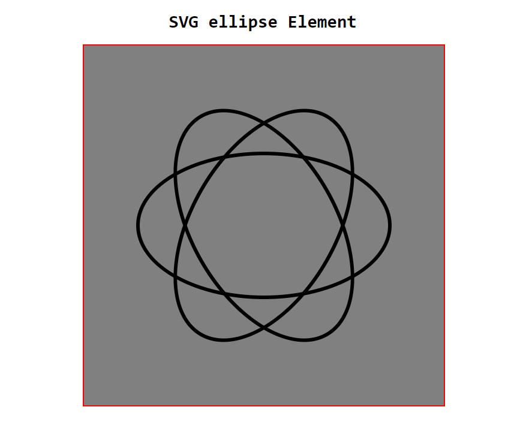

# SVG ellipse Element

## SVG ellipse tag:

    <svg viewBox="0 0 100 100">

        <ellipse  cx="50"  cy="50"  rx="20"  ry="40"  stroke="color"  fill="bgColor"></ellipse>

    </svg>

### Demo image:

