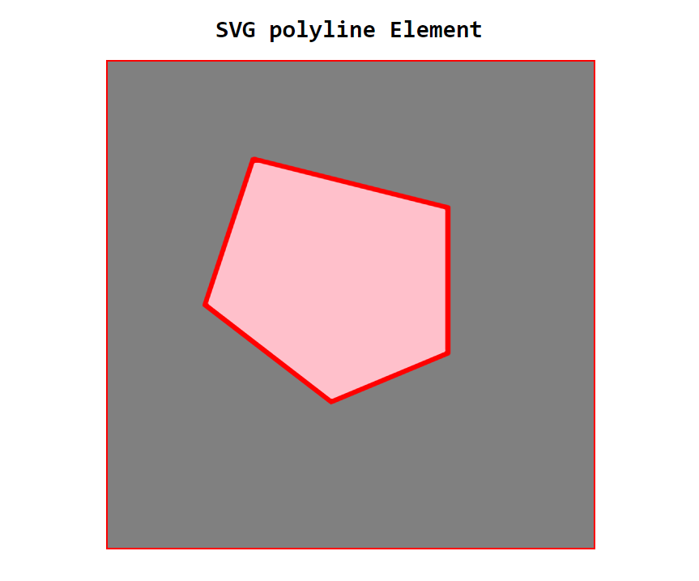

# SVG polyline Element 

## SVG polyline tag:

    <svg viewBox="0 0 100 100">

        <polyline points="points="30,20 70,30 70,60 46,70 20,50 30,19.8 30,20"  stroke="color" fill="bgColor"></polyline>

    </svg>

### Demo image:

