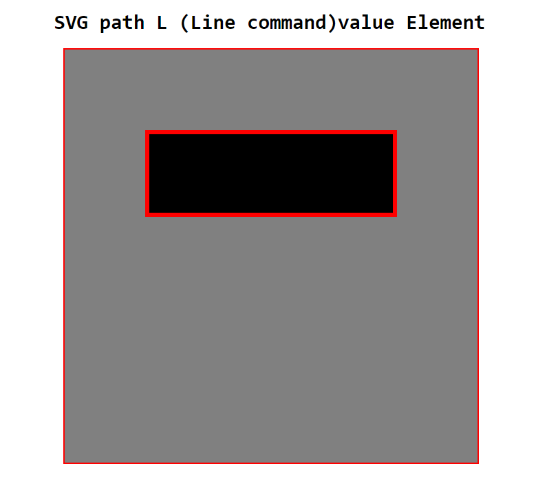
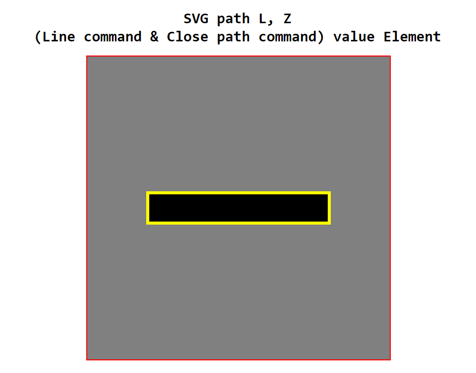
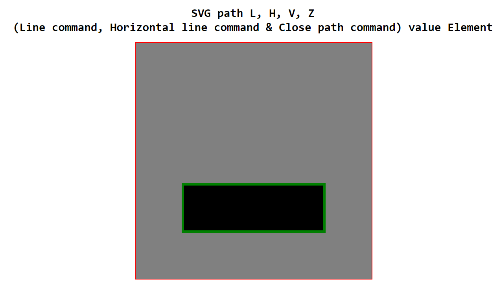
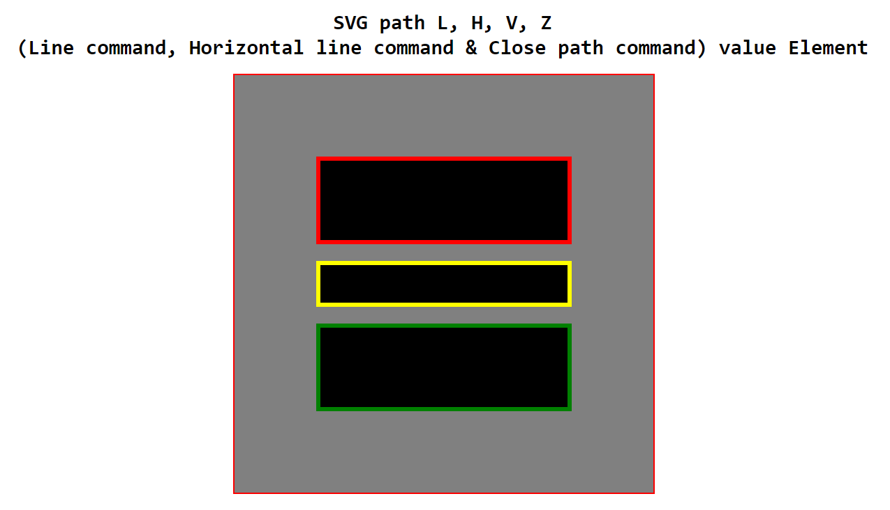

# SVG path Element - i

## SVG path tag:

    <svg>

        <path d="M20,20 L80,20 L80,40 L20,40 L20,19.5" stroke="red" fill="black"></path>

        <path d="M20,45 L80,45 L80,55 L20,55 Z" stroke="yellow" fill="black"></path>

        <path d="M20,60 H80 V80 H20 Z" stroke="green" fill="black"></path>

    </svg>

### Demo image:

#### Use Move & Line command:

#### Use Move, Line and Close path command:

#### Use Move, Horizontal, Vertical & Close path command:

#### Use Move, Line, Horizontal, Vertical & Close path command:
 