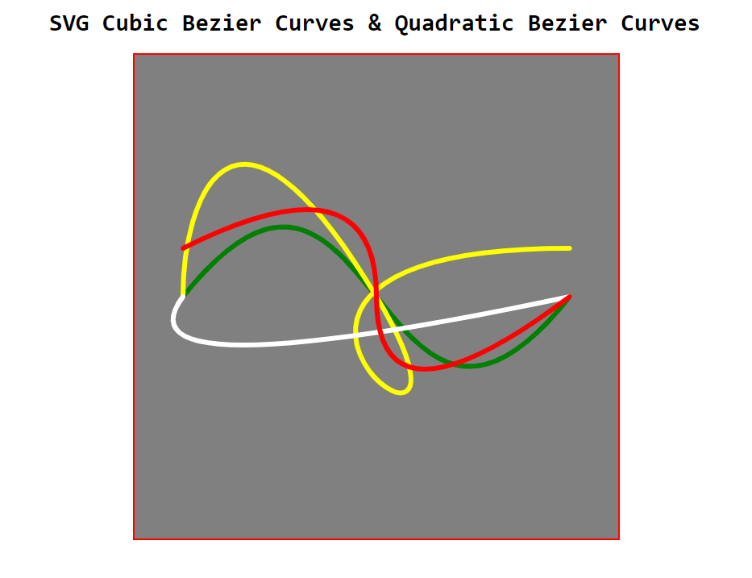

# SVG path Element - ii

## Topic

1. Cubic Bezier Curves

2. Quadratic Bezier Curves

## SVG Path tag:

    <svg viewBox="0 0 100 100">

        // use Cubic command C
        <path d="M10,50 C50,0 50,100 90,50" stroke="green" fill="none"></path>

        // use Cubic command C & S
        <path d="M10,50 C10,30 20,0 50,50 S0,40 90,40" fill="none" stroke="yellow"></path>

        // use quadratic command Q
        <path class="kk" d="M10,50 Q-5,70 90,50" stroke="white" fill="none"></path>

        // use quadratic command Q and T
        <path d="M10,40 Q50,20 50,50 T90,50" fill="none" stroke="red"></path>

    </svg>

### Demo image:

