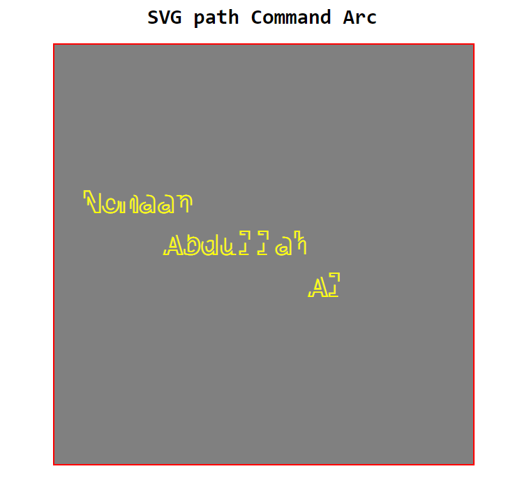

# SVG text element

## SVG text tag:

    <svg>

        <text X="50" Y="50" text-anchor="center">
            Abdullah
                <tspan dx="0" dy="10">
                    Al
                </tspan>

                <tspan x="30" y="20">
                    Nomaan
                </tspan>

        </text>

    </svg>

### Demo image:

