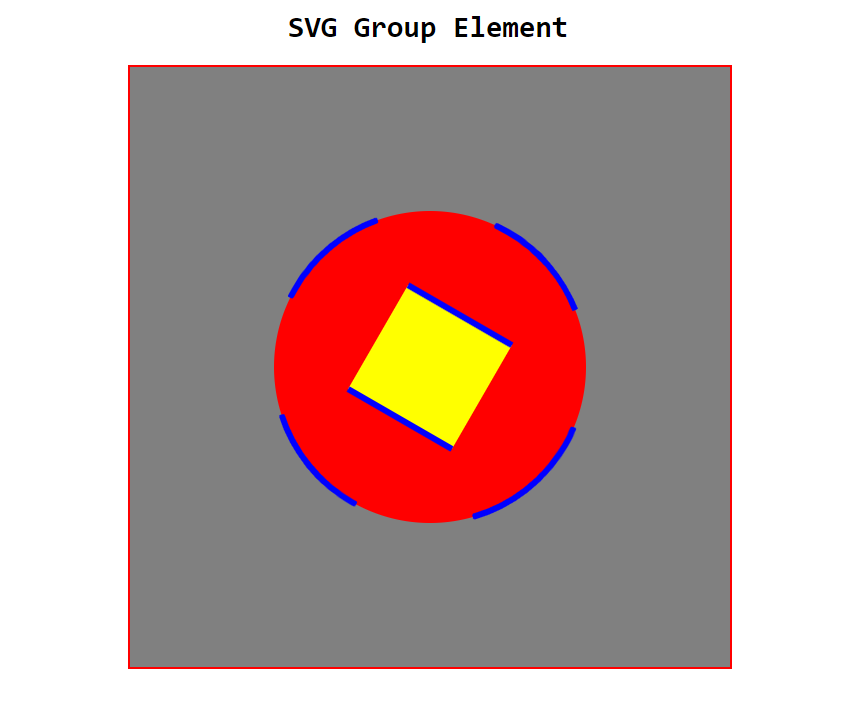

# SVG group Element

## SVG group element tag:

    <svg viewBox="0 0 100 100">

        <g class="combine">

            <circle CX="50" CY="50" r="26" fill="red"></circle>

            <rect X="40" Y="40" width="20" height="20" fill="yellow"></rect>

        </g>

    </svg>

###  Demo Image:

