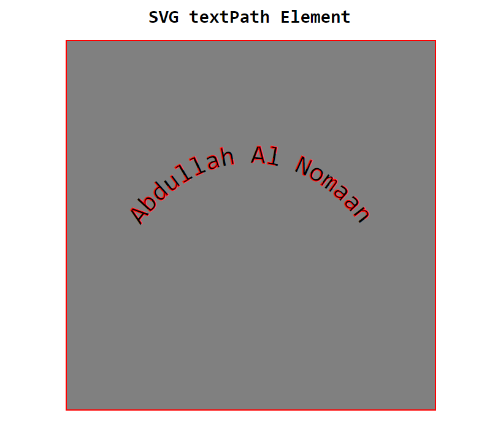

# SVG textPath Element

## SVG textPath tag:

    <defs>
        <path id="shape" d="M20,50 A40,50 0 0,1 80,50" fill="none" stroke="red"></path>
    </defs>

    <text class="name">
        <textPath xlink:href="#shape">Abdullah Al Nomaan</textPath>
    </text>

### Demo image:

