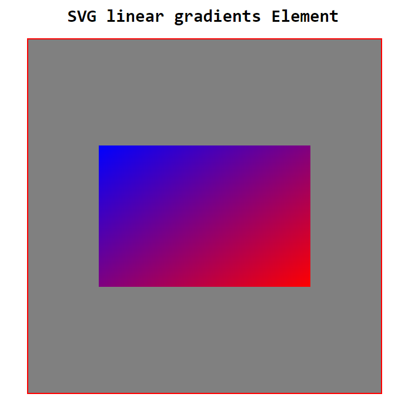
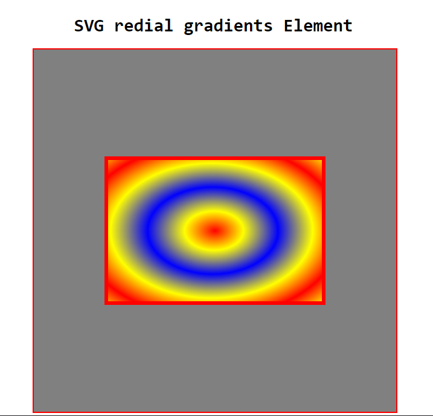

# SVG gradient element

## SVG linear gradient element:

### HTML
    <svg viewBox="0 0 100 100">

        <defs>

            <linearGradient id="linGar" x1="100%" y1="100%" x2="0%" y2="0%">
                <stop offset="0%" stop-color="red" stop-opacity="" />
                <stop offset="100%" stop-color="blue" stop-opacity="" />
            </linearGradient>

        </defs>

        <rect class="lin" x="20" y="30" width="60" height="40" fill="black"></rect>

    </svg>

### CSS

    .lin {
            
        fill: url('#linGar');

    }

### Demo image:

## SVG radial gradient element:

### HTML

    <svg viewBox="0 0 100 100">

        <defs>

            <radialGradient id="graColor" cx="49%" cy="50%" r="30%" fx="50%" fy="50%" spreadMethod="pad/repeat/reflect">

                <stop offset="-10%" stop-color="red" stop-opacity="" />
                <stop offset="45%" stop-color="yellow" stop-opacity="" />
                <stop offset="100%" stop-color="blue" stop-opacity="" />
                
            </radialGradient>

        </defs>

        <rect class="gra" x="20" y="30" width="60" height="40" stroke="red"></rect>

    </svg>

### CSS

     .gra {

        fill: url('#graColor');

    }

### Demo image:

